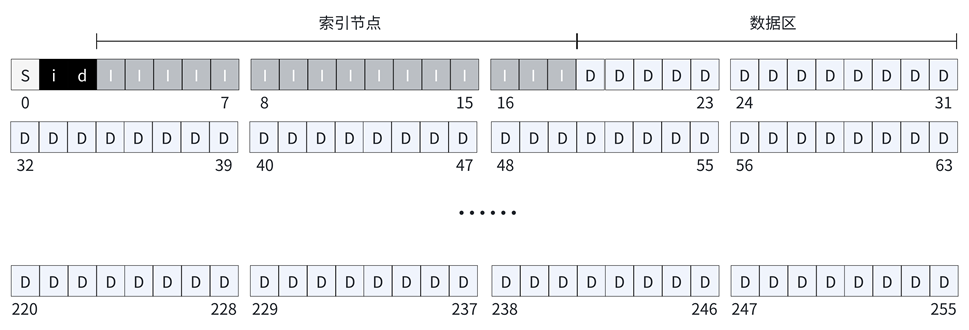
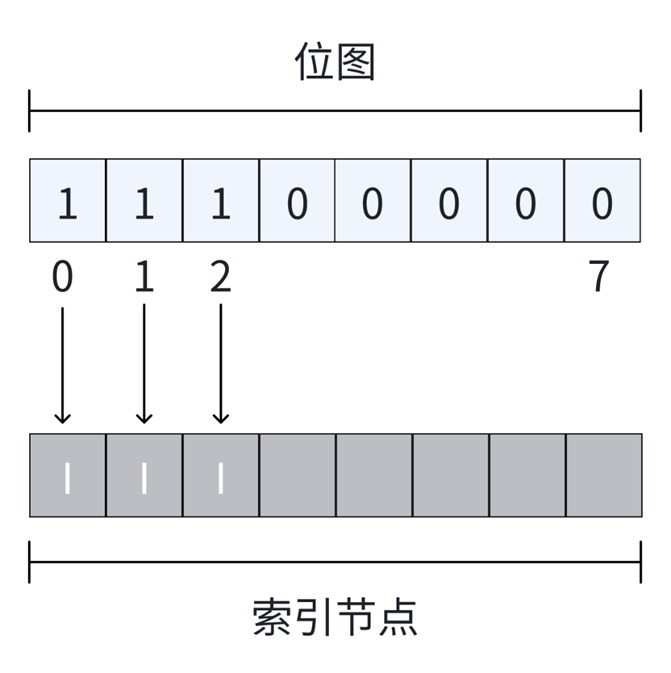
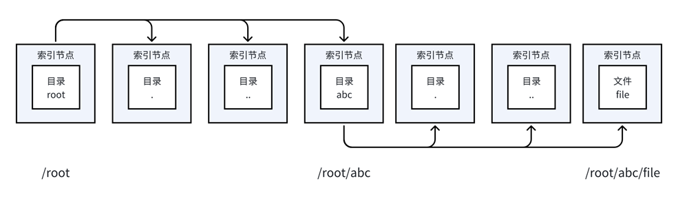
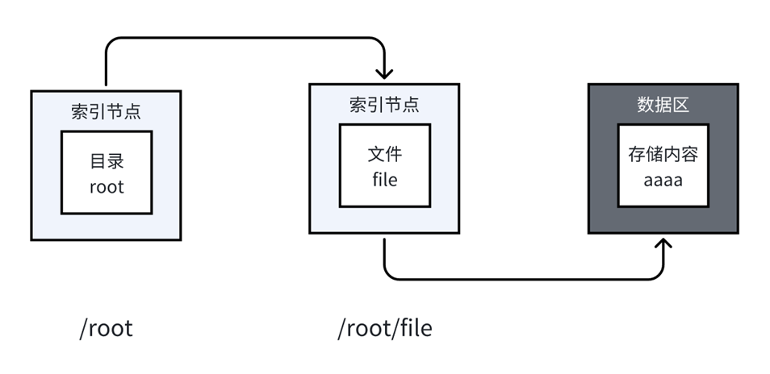
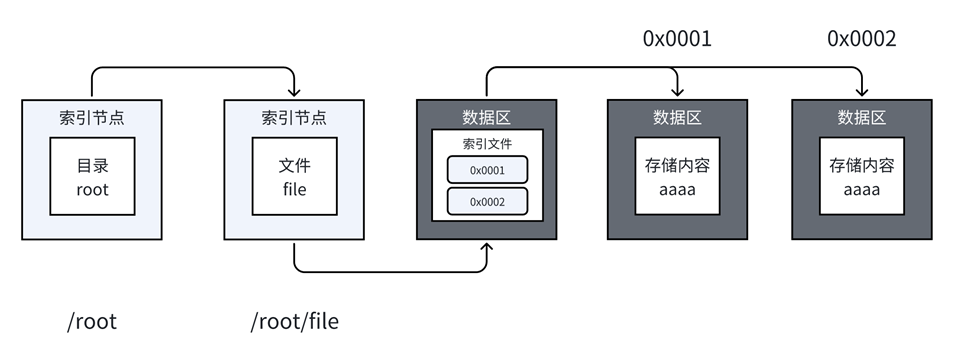

# 前言
这是一个用于应付课程设计的简单的文件系统。

代码存在大量指针滥用的情况，内存随缘分配，有些功能实现也有问题，间接指针实际上也没有被实际使用等等 **~~（但又不是不能用）~~**

# 文件结构
main.c：程序入口

operate.h：命令实现

filesystem.h：文件系统相关的实现

disk：在第一次执行后生成，存储文件系统中的数据

# 存储结构

本文件系统设计的存储空间为 1MB，每个数据块的大小为 4KB，可以划分 256 个数据块。具体划分情况如下图：

S：超级块。位于 0 号位

i：索引节点位图。位于 1 号位

d：数据区位图。位于 2 号位

I：索引节点。位于 3 号位至 18 号位，总计占用 16 个数据块

D：数据区。位于 19 号位至 255 号位，总计占用 237 个数据块

## 数据块

硬盘最底层的读写 IO 一次是一个扇区 512 字节，如果要读写大量文件，以扇区为单位肯定很慢很消耗性能，所以硬盘使用了一个称作逻辑块的概念。逻辑块是逻辑的，由磁盘驱动器负责维护和操作，它并非是像扇区一样物理划分的。有了逻辑块之后，磁盘控制器对数据的操作就以逻辑块为单位，一次读写一个逻辑块，磁盘控制器知道如何将逻辑块翻译成对应的扇区并读写数据。

在文件系统中，以数据块的方式存储数据，使得在文件系统层面上读写性能大大提高，也大量减少了碎片。但是它的副作用是可能造成空间浪费。例如，如果逻辑块的大小是 4KB，存储一个只有 1KB 的文件，那么剩下的 3KB 在这个逻辑块内就被浪费了。这种浪费发生在文件系统分配的存储单元内部。但是相比使用逻辑块带来性能提升，一部分的存储空间损失也是值得的

在上图中，每个格子就代表一个数据块。数据块可以用来存储超级块、索引节点位图、数据区位图、索引节点、数据区等数据。

## 超级块

超级块是文件系统的元数据核心，存储了整个文件系统的总体信息。

## 索引节点位图

索引节点位图是一个用于跟踪索引节点使用情况的数据结构。

在上图中，位置0至位置2比特位为1，说明0号索引节点至2号索引节点已经被使用。而其他比特位均为0，表示这些比特位对应的索引节点还没有被使用。

## 数据区位图

与索引位图类似，数据块位图是用来跟踪数据块使用情况的。它也是一个整型数组，通过比特位来标记数据块是否被分配。比特位为 1 表示该数据块已被使用，为 0 则表示未被分配。

## 索引节点

索引节点是文件系统中用于描述文件或目录属性和存储位置的关键数据结构。每个文件或目录都有一个唯一的索引节点。

每个文件都有一个索引节点，在将索引节点关联到文件后系统将通过索引节点号来识别文件，而不是文件名。因为编号是独一无二的，而文件名在不同目录中是允许同名的。在访问文件时，先找到索引节点，通过索引节点中记录的数据块位置找到该文件。

一个索引节点占用约 256 字节，1KB 有 4 个索引节点，一个数据块有 4K，即一个数据块有 16 个索引节点。

## 数据区

数据区是文件系统中实际存储文件内容的地方。每个数据区对应一个数据块的大小。

在本文件系统中，数据区用于存储文本数据和间接索引文件数据。当数据块中存储数据后，仍然存在空间，使用'\0'占用未被使用的空间。

# 文件介绍

## 目录

可用来存储当前目录的文件和目录。

需要注意的是：

- 在文件系统初始化的时候，需要生成根目录 root，作为进入系统时的“当前目录"

- 每个目录的创建，都需要额外创建两个隐藏目录：“.” 和 “..”。它们分别用来表示当前目录和上级目录，用于目录定位

- 目录存储在索引节点当中。在没有存储文件时，并不需要分配数据区的数据块。

- 通过直接指针指向当前目录所存储文件的索引节点，来管理当前目录所存储的文件

假设现在有目录 root 和目录 abc。在目录 root 中包含目录 abc，目录 abc 包含文件 file。用箭头表示直接指针。可表示为：

## 普通文件

文件元数据使用索引节点表示，其存储的实际数据则存储在数据区当中。

- 当存储小文件时，索引节点的直接指针指向数据区。

- 当存储大文件时，间接指针指向间接索引文件，根据索引文件来寻找数据区

假设现在有目录 root，该目录存放文件 file，文件 file 的内容为“aaaa”。省略当前目录和上级目录，使用箭头表示直接指针，可表示为：

## 间接索引文件

在文件中使用间接指针字段存储索引文件的地址。索引文件的数据存储在数据区当中。

一个 int 占用 4B，那么一个 4KB 的数据块能存储 1024 个整型数据。索引文件使用 1024 个 int 存储 1024 个数据区地址。也就是说，使用间接索引可以用来指向 1024 个数据区。而直接索引最多只能指向 12 个数据区。间接索引极大地扩充了数据区的范围，但是通过间接索引文件来寻找数据区，将带来额外的时间和空间开销。寻址方式见下图（为了方便表示，索引文件直接存储地址，而不是编号）

# 参考

1. https://www.qtmuniao.com/2024/02/28/mini-filesystem/

2. https://www.51cto.com/article/603104.html